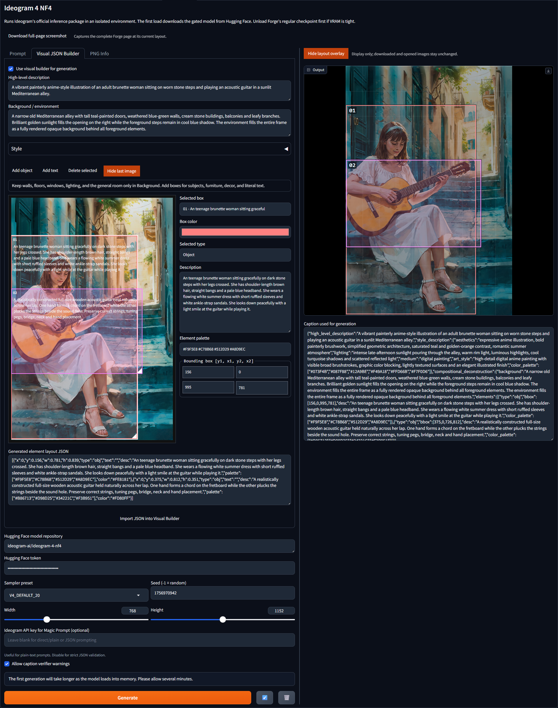

# Ideogram 4 for Forge Neo

This extension adds a separate **Ideogram 4** tab to Forge Neo and runs
Ideogram's official inference package in an isolated Python environment.
Forge's own Torch and dependencies are not modified.

## Install from Git

1. Accept the gated model license:
   https://huggingface.co/ideogram-ai/ideogram-4-nf4
2. In Forge Neo, open **Extensions > Install from URL**.
3. Paste this repository's Git URL and install it.
4. Restart Forge Neo. The extension creates its isolated environment and
   installs its dependencies during startup. The first setup downloads a
   large CUDA-enabled PyTorch package and can take several minutes.
5. Either paste a Hugging Face read token into the tab or authenticate the extension
   environment:

   `env\Scripts\hf.exe auth login`

6. Open the **Ideogram 4** tab.

For a manual installation, clone this repository into Forge Neo's
`extensions` directory and restart Forge Neo:

```powershell
cd path\to\sd-webui-forge-neo\extensions
git clone https://github.com/Whatwhatio/forge-neo-ideogram4.git ideogram4_forge
```

If automatic setup fails, close Forge Neo and run `setup.bat` once.

The first generation downloads the weights to the normal Hugging Face cache
and loads the model automatically. Download, model-loading, sampling-step,
decoding, and save progress appears in both the Forge Neo console and the tab.

The blue down-arrow restores the settings from the previous generation
attempt. The trash button clears the prompt and restores builder defaults.
Settings are saved before generation begins, so they survive a failed
generation or worker crash. Hugging Face and Ideogram API tokens are never
written to this file.

**Download full-page screenshot** captures the complete Forge page without
changing browser zoom. The **PNG Info** tab reads metadata from Ideogram PNGs
and can restore their prompt, settings, and boxes into the visual builder.

## Visual JSON Builder

You can write an Ideogram JSON caption manually in the **Prompt** tab, but this
is not recommended for most users. The required structure, key ordering,
bounding boxes, and nested style fields are much easier to manage with the
**Visual JSON Builder**.

Open **Visual JSON Builder** and check **Use visual builder for generation**.
When enabled, the extension constructs the complete Ideogram caption from the
form and layout boxes.



The example above describes a painterly anime-style scene of a woman playing
an acoustic guitar in a Mediterranean alley:

- **High-level description**: Summarize the complete image in one or two
  sentences. Include the main subject, action, location, composition, and
  overall visual style. In the example, this describes an adult brunette woman
  playing an acoustic guitar in a sunlit Mediterranean alley.
- **Background / environment**: Describe only the setting that should fill the
  whole image behind the positioned subjects. Include architecture, landscape,
  weather, lighting, and environmental details. In the example, this contains
  teal-painted doors, weathered walls, stone buildings, balconies, foliage,
  steps, and sunlight. Do not repeat the main subject here.
- **Style type**: Choose **Photograph** for realistic photographic output or
  **Artwork** for anime, illustration, painting, graphic design, and other
  non-photographic styles.
- **Aesthetics**: Describe the overall visual character and mood, such as
  `expressive anime illustration, bold painterly brushwork, saturated teal and
  golden-orange contrast`.
- **Lighting**: Describe the direction, color, quality, and intensity of the
  light. The example uses intense late-afternoon sunlight, warm rim light, cool
  turquoise shadows, and reflected light.
- **Medium**: Enter the physical or digital medium, for example `photograph`,
  `digital painting`, `watercolor`, or `3D render`.
- **Camera details or art style**: For photographs, describe lens, viewpoint,
  depth of field, and photographic treatment. For artwork, describe rendering
  technique, linework, brushwork, shading, and finish.
- **Overall palette**: Add optional hexadecimal colors separated by spaces,
  such as `#073F4B #087F88 #F49A18 #FFD66B`. These guide the image-wide color
  scheme.

### Layout boxes

Use boxes for foreground subjects, props, furniture, signs, and literal text.
Drag a box to move it and drag its lower-right handle to resize it. Boxes may
overlap. The output **Width** and **Height** controls determine the canvas aspect
ratio.

- **Add object**: Adds a region for a person, animal, prop, or other visual
  object. The example uses box `01` for the woman and box `02` for the guitar.
  Separating the guitar into its own box gives Ideogram more explicit
  instructions about its shape and placement.
- **Add text**: Adds a literal typography region. Enter the exact words in
  **Literal text**, then explain the sign, label, material, font, and lighting
  in **Description**.
- **Delete selected**: Removes the currently selected box.
- **Show last image**: Displays the previous generated image behind the layout
  boxes for alignment. It is only a preview and is not included in saved or
  downloaded images.
- **Selected box**: Selects a box directly when several overlap or when it is
  difficult to click on the canvas.
- **Box color**: Changes the editor and output-overlay color for that box. It
  is display metadata and does not control the generated object's actual color.
- **Selected type**: Switches the selected region between **Object** and
  **Text**.
- **Description**: Describe only the contents of the selected region. Include
  appearance, pose, action, materials, anatomy, and spatial relationships. In
  the example, box `01` describes the seated woman, while box `02` concentrates
  on the guitar's strings, neck, bridge, tuning pegs, and hand placement.
- **Element palette**: Adds optional hexadecimal colors for the selected
  element only.
- **Bounding box `[y1, x1, y2, x2]`**: Fine-tunes the box numerically on an
  Ideogram coordinate grid from `0` to `1000`. The top-left corner is `0,0`;
  the bottom-right corner is `1000,1000`.

**Generated element layout JSON** updates from the boxes automatically. You can
also paste compatible layout JSON into this field and click **Import JSON into
Visual Builder**. Importing is useful for prompts shared by other users or
`elements_data` copied from KJNodes' `Ideogram4PromptBuilderKJ`.

The layout field uses the same normalized `x`, `y`, `w`, `h` region format as
KJNodes' `Ideogram4PromptBuilderKJ`.

### Generation settings

- **Hugging Face model repository**: Leave this as
  `ideogram-ai/ideogram-4-nf4` unless you intentionally use a compatible
  repository.
- **Hugging Face token**: Enter a read token from the Hugging Face account that
  accepted the model license. Tokens are kept in memory and are not written to
  the saved prompt settings.
- **Sampler preset**: Selects Ideogram's official sampling configuration.
  `V4_DEFAULT_20` is the normal starting choice.
- **Seed**: Use `-1` for a new random result each generation, or reuse a
  specific seed to reproduce and refine a composition.
- **Width / Height**: Set the output resolution and Visual Builder canvas
  shape. The example uses `768x1152`.
- **Ideogram API key for Magic Prompt**: Optional and mainly useful for plain
  text prompts. Leave it blank when using structured Visual Builder captions.
- **Allow caption verifier warnings**: Allows generation to continue when the
  official Ideogram verifier reports non-fatal caption-format warnings.
- **Generate**: Saves the current prompt settings, downloads and loads the model
  when necessary, then generates the image.
- **Blue down-arrow**: Restores the previous prompt and generation settings.
- **Trash button**: Clears the current prompt and returns the builder to its
  default state.

The first time you click **Generate**, allow several minutes while the
extension downloads the required gated model and its isolated CUDA-enabled
PyTorch environment, then loads the model into memory. Later generations reuse
the downloaded files and loaded pipeline.

## Video example

The linked demonstration uses ComfyUI, but its Ideogram prompt-builder workflow
is very similar to this extension's Visual JSON Builder:

[Ideogram 4 prompt-builder demonstration in ComfyUI](https://www.youtube.com/watch?v=XKYPlTu1c3M)

## Safety-filter output

A gray result saying **Image blocked by safety filter** is not a precise error
message. It can mean that Ideogram's safety filter rejected the requested
content, or that an incomplete/non-JSON caption caused a false positive.
Ideogram's official documentation notes that false positives are more common
with captions outside its structured JSON format.

The **Generated element layout JSON** field contains only the layout
`elements` array. It is valid input for **Import JSON into Visual Builder**, but
it is not a complete caption for the **Prompt** tab. A complete caption is a
JSON object containing `compositional_deconstruction`, including both
`background` and `elements`; a high-level description and complete style
description are also strongly recommended. Keep **Use visual builder for
generation** checked so the extension wraps the layout boxes in the complete
caption structure automatically.

## Rollback

Close Forge Neo and delete this entire `ideogram4_forge` directory. No Forge
core files or Forge Python packages are changed.

## Licensing

The extension integration code should be distributed under the license chosen
by its author. The bundled `official_source` directory is Ideogram's official
inference code and is distributed under Apache License 2.0; its original
license is retained in `official_source/LICENSE.md`.

The Ideogram 4 model weights are not included in this repository. Users
download them separately from Hugging Face and must accept Ideogram's
Non-Commercial Model Agreement:
`official_source/model_licenses/LICENSE-IDEOGRAM-4-NON-COMMERCIAL`.

This is an unofficial community extension and is not endorsed by Ideogram.
